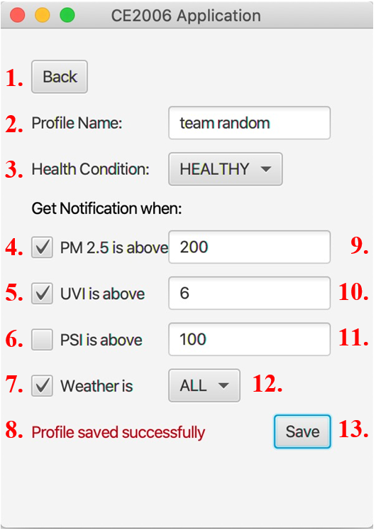

# WeatherMaps Application

The product is a JavaFX application that requires internet to fetch information and display results. 
The required information is obtained from the Singapore Government data API and the Google Maps API. 
The map view in the application is implemented using HTML file. The user profile is stored in a properties file.

## 1. Getting Started

### 1.1 Operating Systems Supported

- Windows
- MacOS or MacOS X (Recommended)
- Linux

### 1.2 Environment

The application requires Java version 8 or later to be able to run. Users are required to install JDK8 or later on 
their operating system. 

Java installation guide: https://openjfx.io/openjfx-docs/#install-java

### 1.3 Libraries
- JavaFX library, which is available as a fully integrated feature of Java SE8 or above and JDK8 or above: 
https://openjfx.io/openjfx-docs/#install-javafx
- Java JSON library (included in the repository)

### 1.4 Clone Repository

After installing the above environments and libraries, we can proceed to clone the repository.

``git clone https://github.com/weichee98/Weather-Maps.git``

### 1.5 IntelliJ IDEA Setup

1. Use IntelliJ IDEA to open the folder `ce2006project_maven`
2. In the `Run` tab, select `Edit Configurations`
3. Setup the configurations as follows:

4. Open `ce2006project_maven/src/main/java/Tools/Keys.java`
5. Replace `"YOUR_KEY"` with your own GoogleMaps API key: 
https://developers.google.com/maps/documentation/javascript/get-api-key
6. Enable the following APIs for your API key:
  - Geocoding API
  - Directions API
  - Maps JavaScript API

## 2. Overall Description

### 2.1 Product Functions

To use this application, user will need to input the starting location and the destination, both in Singapore. 
The application will then fetch and display the route information from the Google Maps API. 
The weather information for the two locations are requested from the Singapore Government data API. 
Weather information and its corresponding warnings or recommendations will be displayed according to user preferences 
specified in his/her profile. The profile stores information such as username, health condition of the user and 
notification preferences. If no profile is found, the system will display weather information, warnings or 
recommendations based on the default settings. Users can edit and save their profile.

### 2.2 Design and Implementation Constraints

- As weather information is retrieved from the publicly available Singapore Government dataset, therefore, this 
application is limited for querying locations in Singapore only.
- As there are many possible weathers provided by the Singapore Government dataset, these weathers are classified 
into limited classes to simplify the implementation of warning and recommendations logic. 
The classes include thundery, rain, showers, cloudy, windy, hazy and fair.

## 3. Interfaces

### 3.1 User Interfaces

#### 3.1.1 Main User Interface

1. Profile Button: Go to the Profile UI scene
2. Start Point Entry: Enter start address
3. End Point Entry: Enter destination
4. Get Route Button: Go to Route UI scene

#### 3.1.2 User Profile Interface

1.	Back Button: Go back to Main UI scene
2.	Profile Name Entry: Enter profile name
3.	Health Condition: Choose health condition
4.	PM2.5 Tick: Get alerts for PM2.5 level
5.	UVI Tick: Get alerts for UVI level
6.	PSI Tick: Get alerts for PSI level
7.	Weather Tick: Get alerts for weather conditions
8.	Status Response: Error warnings or saving status
9.	PM2.5 Entry: Enter PM2.5 level
10.	UVI Entry: Enter UVI level
11.	PSI Entry: Enter PSI level
12.	Weather: Choose weather condition
13.	Save Button: Save profile

#### 3.1.3 Route Information Interface

1.	Back Button: Go back to Main UI scene
2.	Recommendation Box: Give warnings and recommendations to users
3.	Weather Condition Box: Display current weather conditions for both the starting location and destination. If the conditions are red, that means the weather condition meets or exceeds the user preset level
4.	Directions Pane: Display directions information
5.	Map: Display the suggested route, can be zoomed in or out

### 3.2 Application Programming Interfaces (API)

- PM2.5 API (Singapore Government Data API)
- PSI API (Singapore Government Data API)
- UV Index API (Singapore Government Data API)
- 2-Hourly Weather Forecast API (Singapore Government Data API)
- Geocoding API (Google Maps Platform)
- Directions API (Google Maps Platform)
- Maps JavaScript API (Google Maps Platform)

## 4. References

- PM2.5 dataset and API reference site: https://data.gov.sg/dataset/pm2-5
- PSI dataset and API reference site: https://data.gov.sg/dataset/psi
- UV index dataset and API reference site: https://data.gov.sg/dataset/ultraviolet-index-uvi
- Weather forecast dataset and API reference site: https://data.gov.sg/dataset/weather-forecast 
- Directions API guide: https://developers.google.com/maps/documentation/directions
- Maps JavaScript API guide: https://developers.google.com/maps/documentation/javascript
- Geocoding API guide: https://developers.google.com/maps/documentation/geocoding

## 5. Appendix

### 5.1 Use Case Diagram

### 5.2 Class Diagram

### 5.3 Sequence Diagrams
.png)

.png)

.png)

.png)

